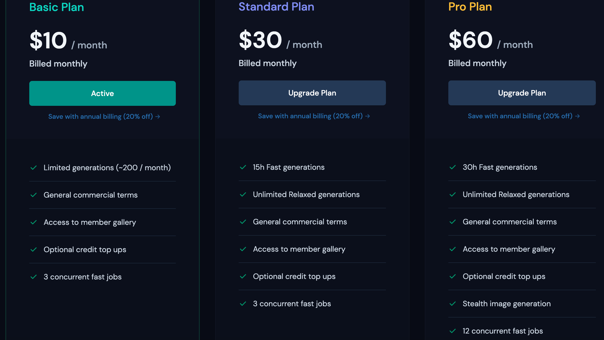
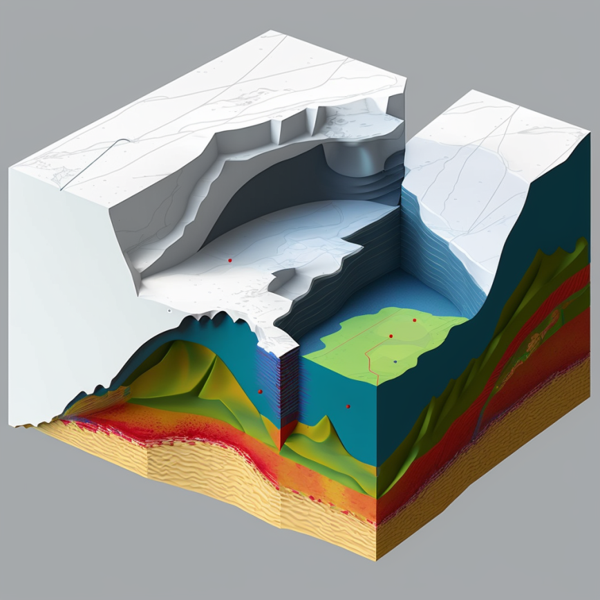
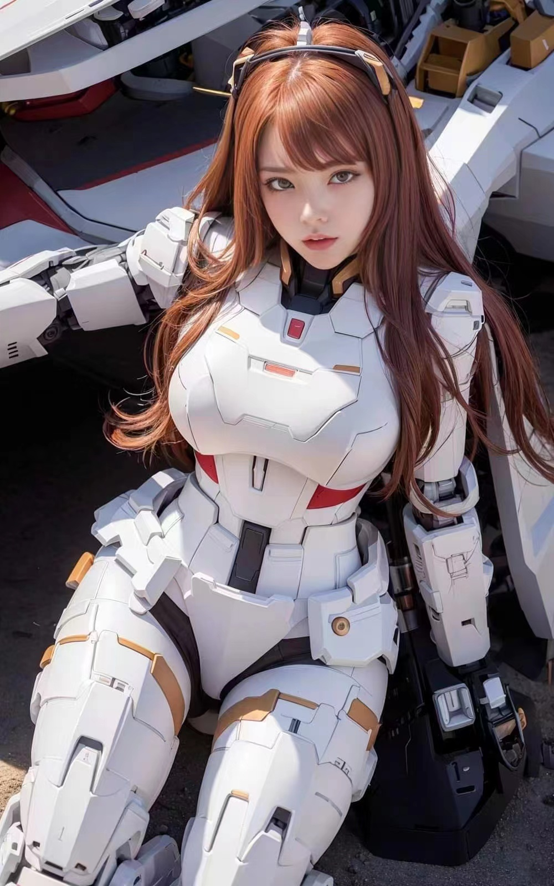

# 最强绘图AI：一文搞定Midjourney（附送咒语）

Midjourney官网：https://www.midjourney.com

## 简介

Midjourney是目前效果最棒的AI绘图工具。访问Midjourney需要科学姿势。

官网只是宣传和登录入口，提供个人主页、订阅管理等功能，Midjourney实际的绘画功能，是在另外一个叫discord的产品中实现的。

Discord是一个即时通讯网站，可用于语音、视频和文本聊天。以及许多其他功能，例如服务器和频道的创建、屏幕共享等等，用户可以创建自己的服务器或加入其他人创建的服务器，并与其他用户交流。Discord也具有丰富的API和插件支持，允许开发人员创建自己的自定义功能和集成。Midjourney就是自己实现图片生成，而用户交互的过程全部交给Discord来做。

## 付费订阅

新用户过去每天有25次免费次数，但Midjourney现在已经停止提供免费服务，想使用需要首先付费订阅。在注册登录之后，在Manage Sub菜单中，选择Monthly Billing按月支付，选择10美元（200张）或者30美元（不限量）的套餐，输入国际信用卡信息，并完成支付。

10美元订阅包含200张图片（200次prompt输入）和3个并行快速作业，以及3h 20m的Fast Hours，作为入门足够了。Fast Hours简单来说就是立刻分配GPU，不用排队的时间。如果用的多。推荐30美元不限量套餐。

支付完毕后可以从左下角的个人菜单中点击“…”，选择“Go to discord”前往discord开始绘画。

通过`/info`命令可以查看剩余资源情况。

## 频道和自建服务器

在Discord的Midjourney主页（Discord称之为服务器）中，选择一个频道即可开始绘画（以#号开头的就是频道名），新手和免费用户可以去newbies系列公开频道，这里可以看到大家使用的Prompt和生成的图片，是一个互相学习的好地方。

付费用户可以点击左侧工具栏的加号按钮，创建一个自己的服务器（只是Discord里的概念，和物理服务器没有关系），然后邀请Midjourney机器人加入，这样就可以实现一对一私聊。

## 绘图

在输入框中，输入/imagine 后面跟上图片的描述信息，就可以开始画图了。对中文支持不是很好，建议全英文操作。Midjourney大约需要1分钟时间一次生成4张图片。

图片下方有两排按钮，U 按钮放大图像，生成所选图像的更大版本并添加更多细节。V 按钮会生成与所选图像的整体风格和构图相似的新图像。图片的顺序如上图。

使用U放大图像后，会得到一组新的按钮：

- Make Variations：创建放大图像的变体并生成四个新图像。
- Beta/Light Upscale Redo：使用不同的升级器模型重做升级。
- Web: 在新标签页上打开图库中的图像
- 表情：每天，排名前 1000 位的评分者都会获得一个小时的免费快速模式时间。

其他相关的[命令](https://docs.midjourney.com/docs/command-list)有：

*   `/blend` 将两个图像混合在一起
*   `/show` 使用图像ID重新生成图片
*   `/fast` 切换到快速模式
*   `/relax` 切换到放松模式

### 图像提示

可以在Prompt的最前面放上图像的链接以影响图像生成结果

### 咒语

虽然只需要一个单词即可生成图片，但精心编写的描述有助于生成令人惊叹的图像。下面是一些常见的咒语，可以在绘画的时候按需结合使用：

画质咒语：high detail, FHD, 1080P, 2K, 4K, 8K, uhd, ultra realistic, studio quality, 8k smooth, masterpiece, hyper quality, high resolution

灯光咒语：hard lighting, volumetric lighting, cold light, mood lighting, bright, soft lights, fluorescent lighting, rays of shimmering light/ morning light,Crepuscular Ray, outer space view,Fairy light,Nixie Tube, cinematic lighting,Dramatic lighting,Rembrandt Lighting,Split Lighting, front lighting,Back lighting, bisexual lighting, rim lights, global illuminations, neon cold lighting,Dark moody lighting,Glowing Radioactivity

渲染咒语：Unreal Engine, octane render, Maxon Cinema 4D, architectural visualisation, Corona Render, Quixel Megascans Render, V-Ray, Corona Render

镜头咒语：ultra wide-angle, wide-angle, aerial view, massive scale, street level view, landscape, panoramic, bokeh, fisheye, dutch angle, low angle, extreme long-shot, long shot, close-up, extreme close-up

在描述的结尾，还可以加入一些[参数](https://docs.midjourney.com/docs/multi-prompts)，用于控制图片的宽高比、使用的模型等等：

*   高品质: `--hyper quality`
*   高分辨率: `--high resolution`
*   尺寸: `-w 1920 --h 1024 --hd`
*   纵横比：`--ar 2:1`
*   `word::数字` 数字越大，单词的权重越大
*   `--no 排除对象` 要求不出现的对象
*   `--iw 0.5-2相似度` 和参考图的相似程度
*   `--seed` 指定种子值进行渲染，用于获取和之前生成图片一致的视角
*   `--v 5` 使用最新的v5引擎，效果更好
*   `--niji` 动漫风格的模型

详细的参数说明见[官方文档](https://docs.midjourney.com/docs/parameter-list)。

一些技巧：

1. 尽量删除无用的单词，更少的词意味着每个词都有更强大的影响力
2. 专注于描述你想要什么，而不是不想要什么。如果想确保某个东西不出现，可以使用`--no`
3. 指定物体的数量会得到更好的效果

## 取消订阅

取消Midjourney的订阅，可以在个人中心的Manage Sub中。在Plan Details区域中点击Manage按钮，点击Cancel Plan按钮即可取消订阅。取消订阅后，已经付费的订阅周期内依然可以继续使用。

## Midjourney美图欣赏

*（本文部分内容由chatGPT 3.5编写，引用的图片来自Midjourney，更多功能建议参考官方文档并在频道中亲手实验）*