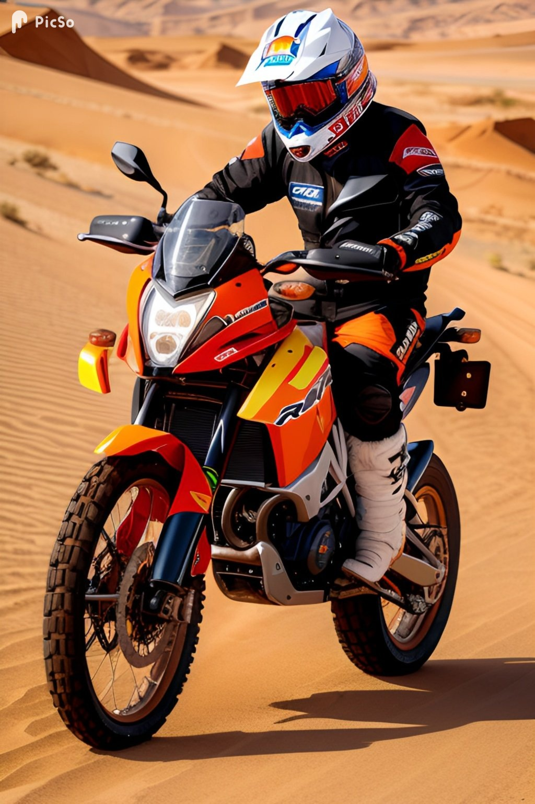
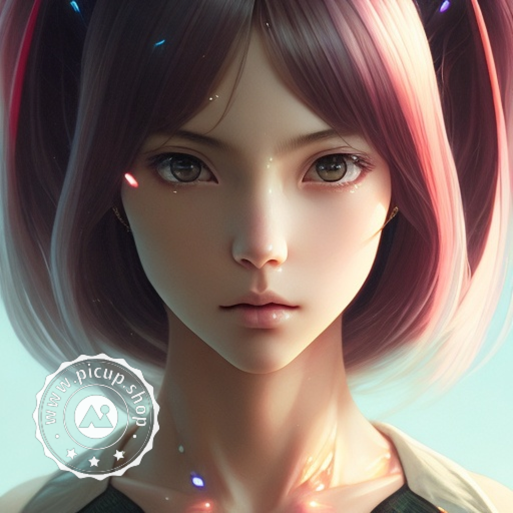
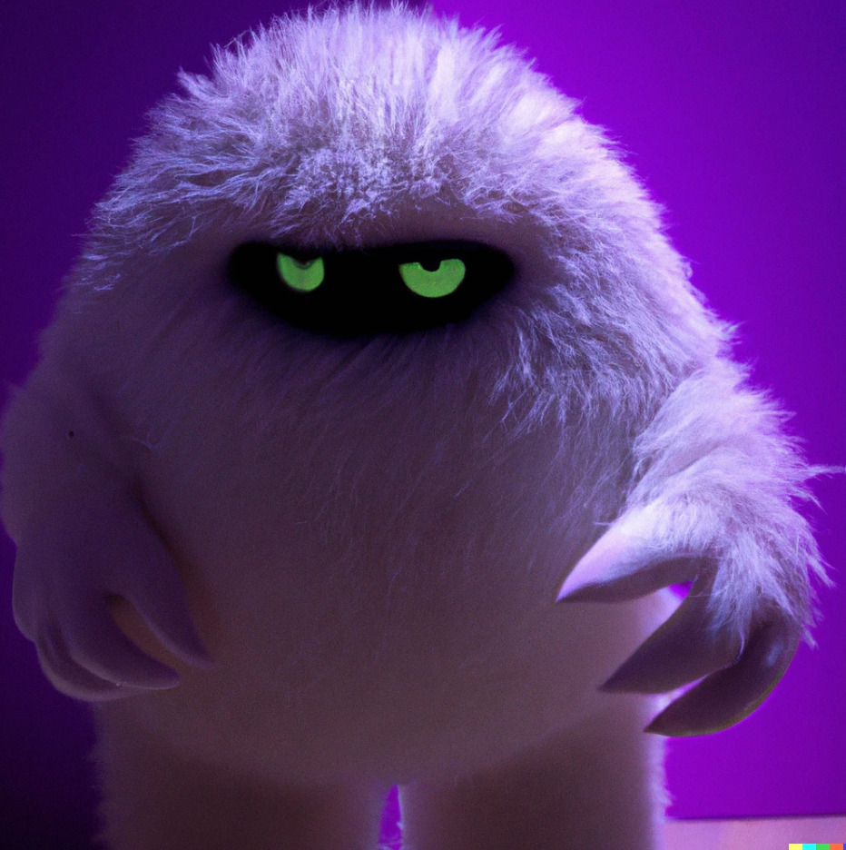
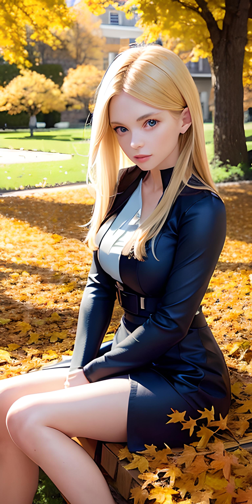

# 这些AI绘画工具教你秒变艺术大师！

在数字化的时代，人工智能技术的不断发展和进步也给艺术领域带来了许多新的可能性。其中，AI绘画工具成为越来越多艺术家和设计师们的首选，帮助他们创作出独特而精美的艺术品。这些AI绘画工具利用深度学习和机器学习算法，能够模仿人类艺术家的风格和技巧，甚至超越人类的想象力。本文将介绍目前流行的12种AI绘画工具，帮助您更好地了解这些工具的功能和特点，以及如何将其应用于您的创作中。

## 12种AI绘画工具，为你解决绘画场景中的各种难题！

从2022年以来，人工智能AI绘画突然火爆街头巷尾，似乎每个微信群里都有人在发送AI绘制的各种惊人绘画作品。

我收集整理了12个AI绘画工具，并使用方式做了简单的使用说明，可以帮助尚未上手的同学们快入进入AI绘画的世界。

## TOP1 Midjourney

https://www.midjourney.com

Midjourney是一款基于人工智能的数字绘图工具，通过它可以创作出令人惊叹的绘画作品。Midjourney的使用非常简单，不需要任何编程技能，只需要输入相应的文字就可以可以自由地创作绘画作品。此外，Midjourney还提供了社交功能，用户可以在平台上分享自己的作品，与其他用户互动和交流。Midjourney不需要任何专业的绘画技能，适合任何人使用，从孩子到成年人都可以使用。

Midjourney是目前效果最棒的AI绘图工具。访问Midjourney需要科学上网。

目前Midjourney已经停止提供免费的配额，需要通过信用卡付费订阅才能使用，价格为10美元200张图，或者30美元不限量。

## TOP2 DALL·E 2

DALL·E：https://openai.com/product/dall-e-2
微软DALL·E助手： https://cn.bing.com/create

DALL·E是OpenAI（chatGPT的公司）于2021年推出的一种人工智能模型，其名称从2008年的动画电影WALL-E（瓦力）和20世纪西班牙加泰罗尼亚画家萨尔瓦多·达利（Salvador Dalí）结合而来。DALL·E能够将自然语言描述转换成对应的图像，使计算机能够通过语言指令生成与描述相符的图片。与其他生成图像的人工智能模型不同，DALL·E可以通过语言描述创造出复杂的、超现实的图像，例如“一只斑点狗坐在一杯气泡水上”或“一只披着早餐面条的小狗”。DALL·E使用了类似于GPT系列的自回归语言模型来生成图片，同时还使用了卷积神经网络（CNN）和变分自编码器（VAE）来处理图像信息。DALL·E的应用潜力非常广泛，可以用于图像生成、图像编辑、计算机辅助设计等领域。

DALL·E也是最早引爆AI绘图话题的产品。目前国内无法访问。

## TOP3 无界版图

http://wujiebantu.com

无界版图是国内运营的AI画图工具，内置多种模型和不同的风格，只需要点选即可设定自己需要的效果和风格，使用非常简单。
最大的优点是即使不科学也可以直接访问，同时提供App，可以在手机上直接操作，非常方便。

## 其他

文心一格：https://yige.baidu.com/

百度是目前国内少数几个大力投入在AI领域且有竞争力的公司。文心系列在去年一直可以免费试用，今年正式发布后反而得申请资格才能使用了。
总体上和其他产品大同小异，从试用情况看，出图质量一般。

- picso.ai：https://picso.ai/create

一个很简单的AI画图平台，出图的质量也很不错

这里还收集了一些类似的平台，功能大同小异，有兴趣可以逐一实验：

- leonardoAI：https://app.leonardo.ai/
- Vega AI 创作平台： https://rightbrain.art/text2Image
- Draft：https://draft.art/explore
- 爱作画：https://aizuohua.com/
- 皮卡智能：https://www.picup.shop/text2image.html#/
- 6pen（速度慢）：https://6pen.art/
- Freehand意绘：https://freehands.cn/

不同平台的默认风格存在区别，多找几个工具，可以在免费额度用完了之后换另外一个平台继续创作。对于优秀的平台，可以付费订阅支持他们的服务。

## 总结

AI技术的发展不仅改变了人们的生产和生活方式，也为艺术家们带来了前所未有的创作机会和工具。本文介绍的12种AI绘画工具，无疑是帮助创作者提供的全新利器。这些工具在不同的方面都具有创新性和实用性，它们让艺术家们可以通过AI技术更加轻松地创造出独特的、令人惊叹的艺术作品。在未来，随着AI技术的不断发展和创新，我们相信会有更多的AI绘画工具涌现出来，为艺术家们带来更多的惊喜和机会。

AI绘画工具的一个重要优点就是让普通人也能够轻松地尝试和享受艺术创作的过程。对于那些本来认为自己没有艺术细胞的人来说，这些工具就是一个很好的机会来探索自己内心深处的艺术潜能。通过使用这些工具，普通人能够用自己的方式表达自己，而不必受限于自己的技能水平或手绘技能。

这些AI绘画工具不仅可以使艺术创作变得更加容易，同时也能够激发普通人的创造力和想象力。人们可以利用这些工具来制作艺术品，同时也可以通过它们来实现自己的设计理念和想法。AI绘画工具为普通人提供了一种全新的艺术创作方式，使人们可以从中发现自己原来隐藏的艺术天赋和潜力，甚至成为一位具有创意和想象力的艺术家。

因此，我们可以看到，AI技术已经在很大程度上拓展了艺术创作的范围，并且为更多的人提供了一个尝试艺术创作的机会。在未来，随着AI技术的不断发展，我们相信这些AI绘画工具将继续为更多的人提供创造性和想象力的平台，让更多的人在艺术领域中发掘和实现自己的潜力。

iPhone 手机的发明和 AI绘画工具的出现都为普通人提供了更多的艺术创作机会，让更多的人可以轻松地享受到艺术创作的乐趣。

与 iPhone 手机让每个人都成为摄影师一样，AI绘画工具也让每个人都成为了一名艺术家。它们不再需要特定的技能或手绘经验，而是通过智能算法来为用户提供快速的艺术创作方案。这使得人们可以从容地展现自己的创意和想象力，用更简单的方式表达自己的内心世界，同时也能够更快地获得创造的乐趣。

另外，相比于传统的艺术创作方式，iPhone手机和AI绘画工具的出现还为艺术创作带来了更多的便利。用户可以通过手机和电脑等设备随时随地进行艺术创作，而不必受限于时间和地点。这大大拓展了艺术创作的范围，让更多的人能够参与到艺术创作中来。

综上所述，iPhone手机和AI绘画工具在让更多人参与艺术创作、让艺术更加便利和多样化等方面有着相似之处。它们都为普通人提供了更多的机会和方式来享受艺术的魅力。

加入创作行列，你没准就是下一个数字艺术家。

## 作品欣赏

