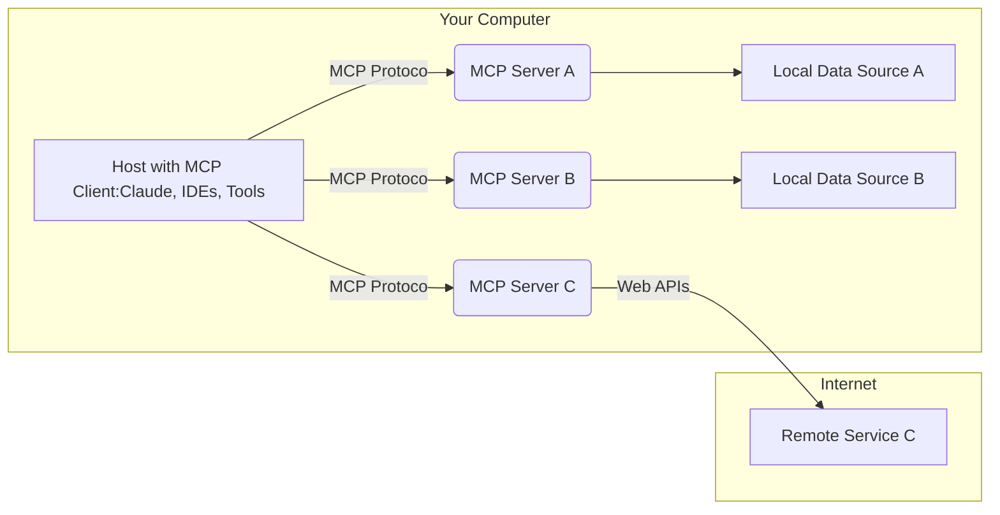

---
html:
  embed_local_images: true
  embed_svg: true
  offline: true
  toc: true
export_on_save:
  html: true
toc:
  depth_from: 1
  depth_to: 4
  ordered: false
markmap:  
  initialExpandLevel: 3
---

# MCP

## 原理

原理请看官网文档：https://anthropic.com/news/model-context-protocol

通过这一张图就看能懂MCP的工作原理了：本地的IDE，例如cursor，充当客户端，连接本地的MCP服务器，MCP服务器连接数据库实现功能。本地的MCP服务器用户无需操心，由IDE通过npx或者docker自动启动。

如下图：

## 为什么MCP可以工作

简单来说，就是大语言模型对自己所处的环境是有理解力的。

当你在一个IDE环境驱动MCP的时候，MCP信息和随同其他环境参数，例如当前打开窗口、当前光标位置等等，一起传递给大语言模型的，大语言模型就能理解当前的环境，从而知道应该调用什么工具。

