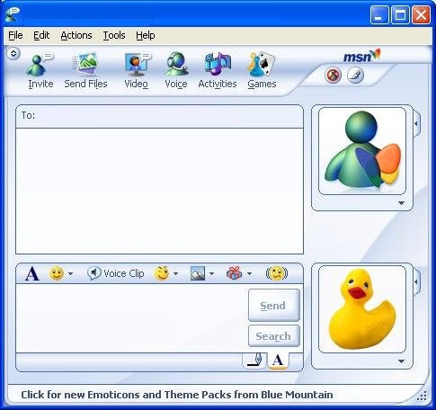

# 微软产品和中文输入法相关的一些缺陷

微软的一些产品，似乎长期以来都存在一些和中文输入法相关的缺陷，不知道是bug，还是产品经理对中文输入的理解与众不同。

今天在用new bing的时候，发现一个小小的问题，就是我在问题框里输入中英文混合的时候，输入法有个特性，中文状态，输入英文也会到输入法框上，这个时候的一个常见操作是按回车，英文就会原文输入，而不会变成汉字。但是在new bing里，在输入法框上直接回车，等于在输入框上直接回车，比如我的问题是“chrome里如何才能关闭quic？”，中文状态下chrome输入完回车直接就被当作问题发给new bing了，其实我还没输入完。我认为是网页错误处理了回车消息，在输入法的输入框上的回车不应该当作真正的回车。

有人可能会觉得是技术问题，网页无法识别是什么回车。但实际只要打开普通bing，就能发现，在普通bing的输入框里，在输入法里回车，文字会和其他编辑器一样，以英文完成输入，并不会在输入框里回车。new bing和老bing在这个细节上的行为是不一致的。

这里不得不提另外一个特别想吐槽的类似问题，就是cn.bing.com中，如果你在输入法状态下输入ESC，那么搜索框里的东西全部会被清空且无法还原，这导致无数次输入的文字丢失，搜索的内容往往是从哪个微信群或者什么地方复制的，输入内容丢失导致还要去寻找刚刚从哪里复制的东西。例如：你从某个微信群的999+未读里复制了一句“tumbleweed”，然后放bing里搜索，发现结果不是你要的，于是你又在后面加了一些关键词，反复几次之后，你在补充关键词的过程中不小心输入错误了，于是按了下ESC企图重新开始输入，此时，bing搜索框里之前输入的全部内容都已经被清空，而且无法恢复。你不记得tumbleweed是如何拼写的，于是回去微信寻找原始单词，但是群里有新消息，tumbleweed的位置被滚到了999条记录之前，于是你再也无法找到这个词语继续搜索了。

巧合的是，这个问题在多年前的MSN Messenger（和QQ竞争聊天工具的那个）中也曾经一直存在，在MSN的输入框中，如果你在输入法里按了ESC，那么输入框中的全部内容都会丢失，且无法undo，同时MSN窗口关闭（ESC关闭窗口，未识别是否处于输入法状态按的ESC），当年发生过很多次写的大段文字丢失的事情。经常对MSN的产品设计耿耿于怀。

当时我曾经因为这个问题对比过QQ的设计，QQ在这种情况下，会弹出一个对话框，询问你是否要关闭窗口。虽然这个询问也是多此一举，但是QQ至少保证了我输入的内容是不会丢失的，QQ的人明显意识到了直接关闭窗口会导入输入丢失的这个小问题并且做了防范。对于我来说，这个问题是导致我不愿意使用MSN Messenger的原因之一。

当年我还调查过别人是否也碰到这个烦恼。结论是：几乎没有。是不是很诡异？我发现大多数人，其实没有在输入错误的时候按ESC快速取消本次输入再重新输入的习惯，绝大多数人的做法，是当输入错误的时候，用退格键一个一个地删除之前输入的内容，然后再重新输入，这种特别没效率的方法，反而避开了这个缺陷。C端用户的行为总是这么超出想象，永远给人惊喜。

微软产品的这些问题，在其他公司产品中很少出现，似乎是微软的“特色”和“传统”，似乎中文输入场景中的这些小细节被微软的产品经理们忽略了。

原文：https://mp.weixin.qq.com/s/2KRQl2R4L3DAAR5E_1f_9w
